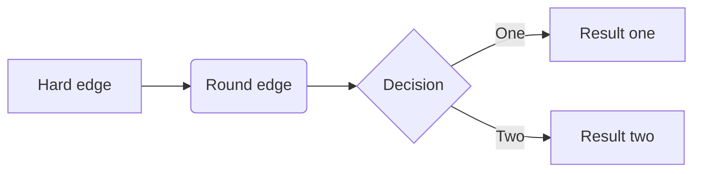

+++ 
draft = false
date = 2024-06-27T13:22:06+10:00
title = "bruh"
description = ""
slug = ""
authors = []
tags = []
categories = []
externalLink = ""
series = []
+++

bruh bruh bruh
```python
print("Hello, Hugo!")
```


```goat
      .               .                .               .--- 1          .-- 1     / 1
     / \              |                |           .---+            .-+         +
    /   \         .---+---.         .--+--.        |   '--- 2      |   '-- 2   / \ 2
   +     +        |       |        |       |    ---+            ---+          +
  / \   / \     .-+-.   .-+-.     .+.     .+.      |   .--- 3      |   .-- 3   \ / 3
 /   \ /   \    |   |   |   |    |   |   |   |     '---+            '-+         +
 1   2 3   4    1   2   3   4    1   2   3   4         '--- 4          '-- 4     \ 4

```


$$
\sigma\Sigma
$$
a is \(\sigma\)